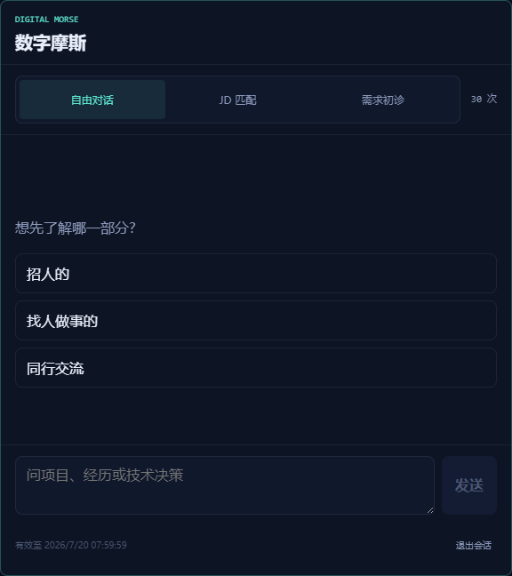
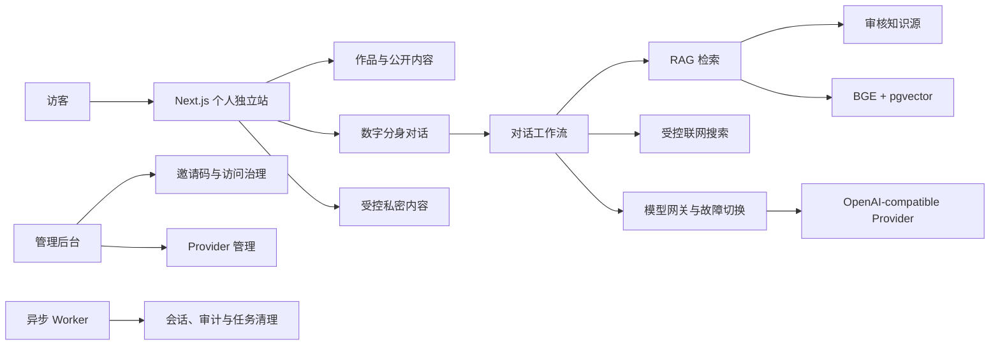

# Morse

AI 原生个人独立站与数字分身系统。

Morse 将个人主页、项目作品集和可追溯 AI 对话整合在一个站点中。访客既可以浏览结构化内容，也可以通过自由问答、岗位匹配和需求初诊等工作流，与基于审核知识构建的数字分身进行交互。



> 本地验收截图 · 示例会话 · 非生产访客数据。

## 核心能力

- **个人独立站**：以统一内容源组织身份信息、项目案例和公开知识，并适配桌面与移动端。
- **AI 数字分身**：提供自由问答、JD 匹配和需求初诊三种对话工作流，用对话代替静态信息检索。
- **可追溯回答**：使用本地 BGE Embeddings、PostgreSQL 与 pgvector 检索审核后的公开知识，回答附带服务端确认的来源。
- **项目作品集**：集中展示内容创作、自动运营、外贸获客、深度研究和数字分身等 Agent 系统。
- **完整治理链路**：包含访问额度、会话恢复、停止与重试、Provider 故障切换、管理后台、异步 Worker 和健康检查。
- **受控内容访问**：私密内容使用独立邀请与 Session、加密存储和审计清理，不进入公开内容、RAG 或模型输入。

## 项目组成

### 数字摩斯

嵌入个人独立站的 AI 数字分身。它基于审核后的公开知识回答访客问题，并通过来源、工作流状态和访问治理控制回答边界。

### 内容创作 Agent 系统

面向企业内容团队的多模态创作系统，将对话式创作、多模型适配、异步生成任务和数字资产管理连接成完整工作流。

### 自动运营 Agent 系统

面向企业运营团队的受控运营系统，连接数据发现、内容沉淀、AI 内容生产、发布校验和任务追踪。

### AI 外贸获客系统

面向外贸销售团队的获客运营系统，串联线索入池、官网信息补全、AI 评分、协同跟进、邮件触达和回信处理。

### 深度研究 Agent 系统

本地优先的多 Agent 深度研究系统，围绕研究问题完成方法发现、证据采集、横纵分析、质量审查和正式报告生成。

## 系统架构



站点页面和 RAG 共用同一份审核后的公开内容源。模型不能自行生成可点击来源，也不能从草稿、私密简历或企业内部资料中补全事实。

## 技术栈

- Next.js App Router、React、TypeScript
- CSS Modules、全局设计 Token、Three.js、GSAP
- PostgreSQL、pgvector、本地 BGE Embeddings
- OpenAI-compatible Responses、SSE、Provider 故障切换
- Node.js Worker、Docker Compose、Caddy

## 本地运行

安装依赖并启动基础站点：

```powershell
npm ci
npm run dev
```

完整数字分身需要按 `.env.example` 配置环境，并启动 PostgreSQL 与本地 Embedding 服务：

```powershell
npm run db:up
$env:MORSE_EMBEDDING_DEVICE = 'auto'
E:\AI\Python\python.exe scripts\local-embedding-server.py
```

随后初始化数据库和公开知识：

```powershell
$env:DATABASE_URL = 'postgresql://revolution@127.0.0.1:55432/revolution'
npm run db:migrate
npm run knowledge:ingest
npm run dev
```

本地 BGE 服务只监听 `127.0.0.1:18091`。生产环境的完整配置、角色划分、健康检查、备份与恢复边界见 [`docs/runbooks/production.md`](docs/runbooks/production.md)。

## 验证

```powershell
npm test
npm run chat:eval
npm run rag:eval
npm run build
```

UI 改动还需检查 1440 与 390 双宽、浏览器控制台、横向溢出和 `prefers-reduced-motion`。上线前 Lighthouse Performance 需达到 90 以上。

## 安全与内容边界

- `content/site-content.json` 是页面与 RAG 的唯一公开内容源；`content/drafts/` 不直接上线。
- 企业内部项目只展示获批的脱敏事实与示例媒体，不提供内部系统、源码或生产数据。
- 私密简历使用独立邀请、独立 Session 和 AES-256-GCM 加密存储，不写入 Git、公开目录、RAG、Provider 输入、截图或日志。
- Provider 密钥、管理员凭据和生产配置只保留在服务端，不进入代码仓库。
- 健康接口只返回通用就绪状态，不公开 Provider、费用、表名或知识库规模。

## 项目状态

项目已经完成生产部署，个人独立站、数字分身、管理后台和私密内容访问均已进入运行状态。当前仍持续完善监控、备份恢复、边缘限流和外部服务验收。

详细设计、决策和验收记录：

- [`docs/portfolio-blueprint.md`](docs/portfolio-blueprint.md)：产品需求与决策源
- [`docs/runbooks/production.md`](docs/runbooks/production.md)：生产部署与运维边界
- [`docs/verify/`](docs/verify/)：功能、视觉、评测与发布证据

## 目录

- `app/`：路由、页面入口与全局样式
- `components/`：正式站组件与 CSS Modules
- `content/site-content.json`：页面与 RAG 的唯一公开内容源
- `content/drafts/`：待人工终审内容
- `db/migrations/`：PostgreSQL 与 pgvector 数据结构
- `scripts/`：运行、摄取、评测、测试与视觉检查
- `docs/`：产品决策、运行手册和验收记录
- `prototype/`：冻结的静态原型，仅供参照
